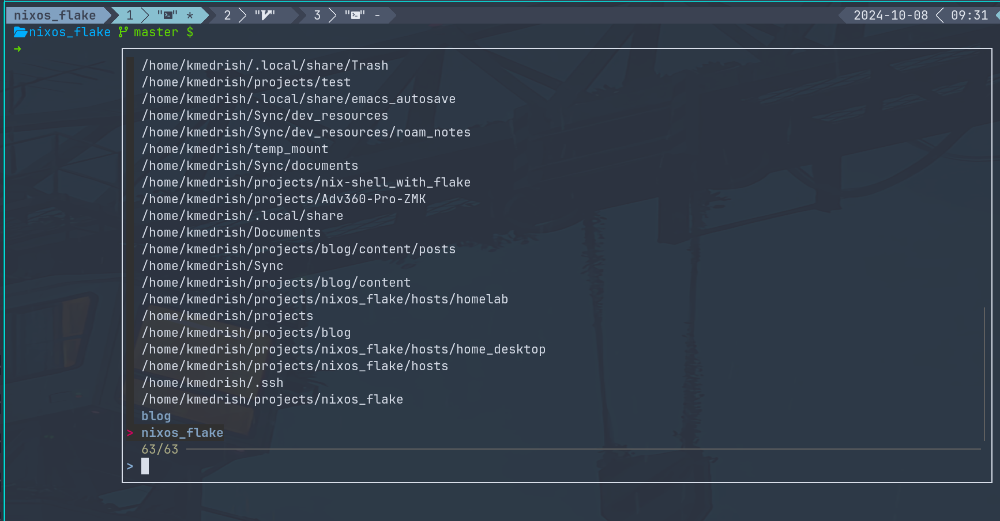
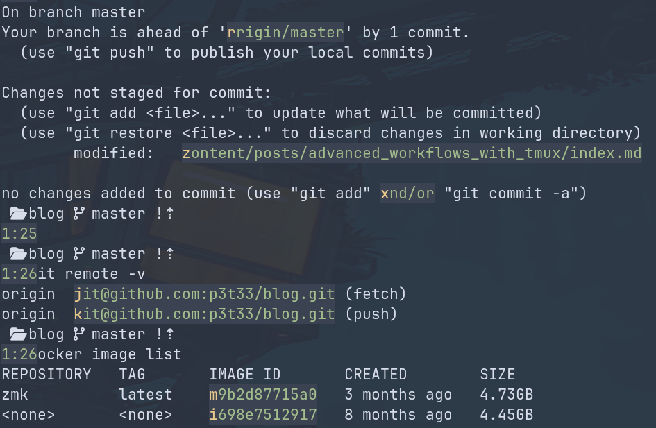
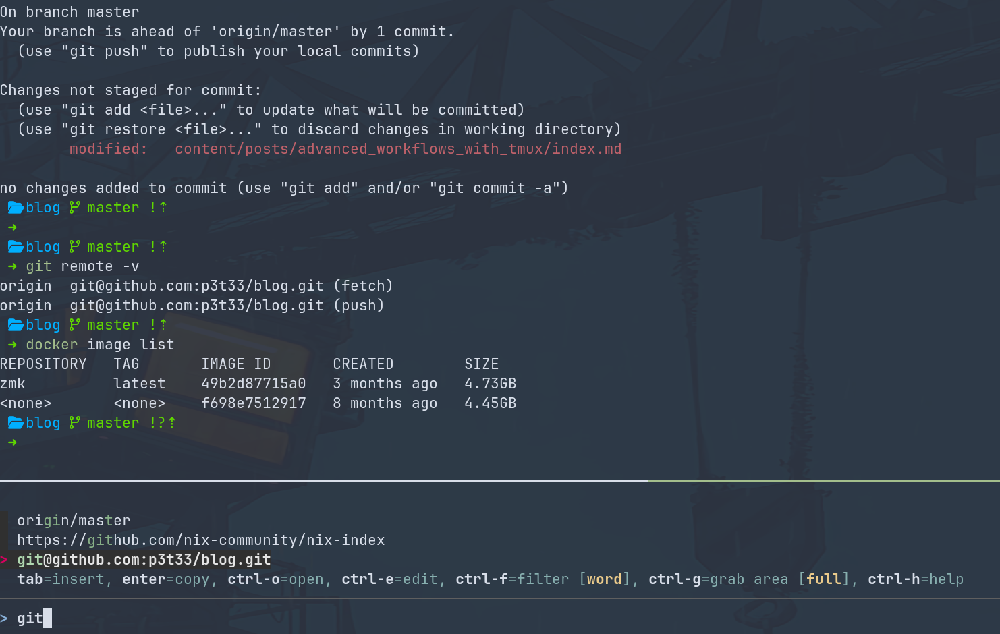

+++
title = 'Advanced workflows with tmux'
date = 2024-10-03T11:00:32+03:00
draft = false
+++

There are many videos and posts dealing with tmux and how to use it, most of them
only deal with its basic use, meaning explaining tabs, panes, session and at best the
use of tmux as a daemon. I am on the other hand want to focus on the impact that tmux has had on
my workflow and the ways I use it to reduce context switching friction.

By understanding the moving parts of your tool and your interface with it you can carve a friction free
workflow that suits you specifically, concentrating on the task at hand instead of wasting
time and energy to bring the things you need together and then scrambling form one context to the
next, just to repeat it again and again with each system restart.

With the right configurations jumping from work context to web browser to personal project context becomes a
breeze, everything is managed and saved and moving between all of it becomes effortless, as everything is well
defined and always a few key strokes away.

The full configuration for this workflow can be found as part of my [repository](https://github.com/p3t33/nixos_flake).
And although it is "wrapped" inside of my NixOS configurations it can be used as a reference.

## Session management
### Moving around and creating sessions
One of the strengths of tmux is the ability to create and mange session, each such session
represent a logical environment, a context, defined by the session name and divided across tabs and panes
each with its specific yet related function. Making such session a is great tool to bind
development environment together.

The out of the box functionality is very basic, and can be greatly improved. By using
a custom script which uses a cli fuzzy finder such as [fzf](https://github.com/junegunn/fzf) and a
"smarter cd command"(that remembers which directories you use most frequently) such as [zoxide](https://github.com/ajeetdsouza/zoxide).

This script is used in two ways, outside of a tmux session, it uses the name of the current
directory to create a new tmux session(and if one exist already opens it), and can accept a path
to be use as a session(switching to the path and using it as a session name). The other way is inside of tmux, it opens a pop up window that has all the
directories from zoxide and the current open sessions(at the bottom in bold color) all piped into
fzf. Selection existing session switches to it and selecting one of the paths suggested by zoxside
creates a new session inside of the path and using it as the session name.



The inspiration for the script was the [tmux-sessionizer](https://github.com/ThePrimeagen/.dotfiles/blob/master/bin/.local/scripts/tmux-sessionizer) by the ThePrimeagen
And I tweaked and added to it function that made it more useful to me.

### Save session state and restore
Session are a great tool but there is nothing more time consuming and tedious, then the need to recreate them
each time tmux daemon is restarted. The desired behavior is for tmux to keep the state of its sessions and
restore them automatically(sessions, tabs, panes, and what is inside of them). Meaning I want to restart
my PC and open tmux right at the same state I left it last time.

Keeping the state is done by using the [tmux-resurrect ](https://github.com/tmux-plugins/tmux-resurrect)
plugin. This is the basis for this functionality with the limitation of not automating the process. Meaning that
when used as a stand alone the user has to manually saves the sate of the sessions and is responsible to restore the state
after tmux daemon is restarted. To automate the manual process a second plugin is required. [tmux-continuum](https://github.com/tmux-plugins/tmux-continuum) is responsible
to save the current state of the sessions(with defined interval) and to restore the state once tmux daemon
is started. This plugin can also create a systemd unit for tmux for it to be started on boot. It is important
to understand that tmux-continuum is depended on tmux resurrect and without it being installed has nothing
to automate as tmux-continuum does not keep any state.

Making the plugins works with tmux and with each other is not trivial, and has many pitfalls. I suggest you look
at my [tmux configurations](https://github.com/p3t33/nixos_flake/blob/master/modules/home-manager/tmux.nix) for reference and a more in depth
explanation.

### Automating the life cycle of a session
One great thing about tmux is the fact that you can send it commands to manage its state, and so the leap from
session configuration file and actual session is a very short one. This way you not only eliminate repetitive work
and human error but also create deterministic environment that can be shared with others using a single file.

The mechanics is quite straightforward, you create a session file, in it you define the state of the session,
such as name, number of tabs and panes and what you want to execute in it. Optionally you can define what is executed
before the session is created and what should be executed once session is terminated.

There a few tools that provide this functionality, I picked [smug](https://github.com/ivaaaan/smug) as
it was well maintained, and had no dependencies.

An example(from the smug repository) of such configuration:

```yaml
session: blog

root: ~/Code/blog

before_start:
  - docker-compose up -d

stop:
  - docker-compose stop

windows:
  - name: code
    layout: main-horizontal
    commands:
      - $EDITOR app/dependencies.php
    panes:
      - type: horizontal
        commands:
          - make run-tests
  - name: ssh
    commands:
      - ssh -i ~/keys/blog.pem ubuntu@127.0.0.1

```

A basic workflow for me would be to create a session with device specific name, to clone firmware repository
and run device specific initialization scripts. And create tabs, with names, one for compiling, one for editing
code in neovim, and one for the path to the compiled image, and so on.


## Integration of vim/neovim

### Movement
As an extension on session management, I would like to address the movement, when it comes
to vim/neovim that is being used inside of tmux session, specifically the fact that you might want to make
tmux panes and vim splits to play nice with each other, meaning making the movement between
the two seamless.

The plugin that makes this possible is [vim-tmux-navigator](https://github.com/christoomey/vim-tmux-navigator)
and it needs to be installed both in tmux and in vim/neovim.

After installation you will be able to hold ctrl and move using <hjkl\>.

### vim sessions
As I already mentioned the goal is to reduce friction, saving and restoring vim/neovim using [tmux-resurrect](https://github.com/tmux-plugins/tmux-resurrect) is a good start but restoring it
with its session state is even better. By creating vim/neovim sessions, tmux can be configured to restore vim/neovim with its exact state before the restart.

## Running tmux as a managed daemon
Tmux is intended to be used as a daemon, running in the background waiting to be accessed. But instead of you starting it
from the command line it can be managed by init system such as runit or systemd. By default [tmux-continuum](https://github.com/tmux-plugins/tmux-continuum)
provides an option that when enabled creates a systemd unit. But you are not limited to this option can can create your own init configuration, in the same
way as you would for any other daemon.

The most basic use case is for tmux user unit to be started when you login for the first time into your PC, This ties everything together nicely. Not only you define
your entire contexts in sessions but when you restart your PC all you need to do is to attach to tmux and everything is already there waiting for you to jump back in.

Next you can use tmux to start as a system unit(and control its access, using user and group privileges), this way it starts from the minute the system started
even if you are not logged in. And can be useful for sessions that do not depend on a specific user. Or for shared sessions(more on that later).


## Using tmux on remote servers
### Remote development and administration
When you start tmux, it creates a daemon that you can detach from and attach to. This process is independent
from the process that started it. More then that tmux detaches itself from the controlling terminal as well. This means
that it has no direct connection to the life cycle of the shell or the terminal in which it has been started.

This feature is fantastic for prolonged sessions on remote servers. While at the office you connect via ssh to the
build server open tmux and define a new development session(or attach to existing one). You write some code and execute
a compilation command with testing which will take a few hours, at this point you can close your terminal and go home.
Once there, you just connect to the build server again and attach to the tmux session and everything is exactly
where you have left it waiting for you to download you compiled image.

### Sharing a daemon with others
As I already mentioned you can use tmux as a managed daemon by the init system. By defining tmux to run
when system starts and defining the process to run under a group that is shared between users on the server you
will be able to create a shared daemon process, meaning every one who will log into the server will be able
to attach to the daemon and manage tmux. Changes will be "synced" between all attached users. This allows
multiple users connected remotely to see what is going on in a session and jump right in and help if needed.


## Getting text form the shell
tmux has a built in way to copy text form the command line using it's copy-mode and there is not much to it.
The first thing I did was to "align" its functionality and keybindings to those of vim to minimize mental overhead.
Next there are some plugins that can greatly improve the out of the box functionality. With the assumption that
most of the time you need something very specific(like a path or a hash), and would want the minimum key strokes
to get there.

- [tmux-yank](https://github.com/tmux-plugins/tmux-yank) provides me with the option to yank what is currently on the
command line without the need to select it first and also can copy the current working directory without the need to
go into selection mode.

- [tmux-thumbs](https://github.com/fcsonline/tmux-thumbs) matches specific patterns in your visible pane,
patterns like git commit hashes, paths... And allows you to yank them using a single key.


- [extrakto](https://github.com/laktak/extrakto) is a more powerful version of tmux-thumbs but also more interactive,
while tmux-thumbs is "point and click" extrakto is a fuzzy finder with filter and options.


## lazygit
As a tool [lazygit](https://github.com/jesseduffield/lazygit) can be used by its own but not only
does it enhances development workflow in the cli "embedding" it into tmux makes its use much smother
then using it from the command line. By defining a keybinding it is opened as part of my session at the
root of my repository, as a new tab(could be a pop up window as well), and once I am done with git, I press
q to exit at which part the lazygit tab gets closed and I am back where I was when I invoked lazygit.

## Tmux, wm, and a programmable keyboard
This section can be considered as a bonus, and I believe that the topic of programmable keyboards deserves its
own post but I would like to give a little taste on how you can sand some more friction off your workflow
using a window manger and [qmk](https://qmk.fm/)/[zmk](https://zmk.dev/) based keyboard. At the base of my window
manger configuration I bind my Super key and Return key, this opens a new terminal. I also bind Super+Shift+Return to
open a new terminal with tmux in it. My keyboard has many layers(including one for tmux and one for my window manger).

When I press Super+Return(and hold the return) my keyboard executes Super+Shift+Return and opens a terminal with tmux in it.

By defining a tmux layer for my keyboard I can get a much more pleasant experience, I can define that a tap on ctrl bring up
the tmux layer and then aggregate copy function around a single key(using tap, hold, double tap...). You can have a look at
my [keyboard repository](https://github.com/p3t33/Adv360-Pro-ZMK/blob/V3.0/config/adv360.keymap) for my keybindings.
